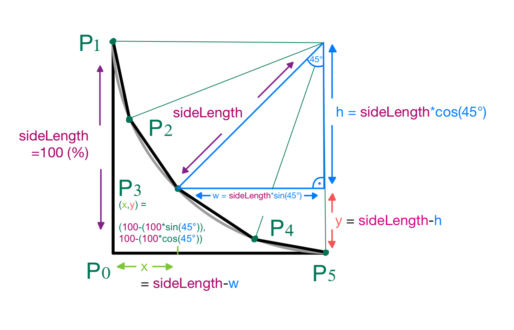

# Inverted Corner Shape Transformation

## Overview
Finally! I created a method to create round, inverted corners in pure js and therefore css!
The provided JavaScript function showcases an elegant application of mathematical principles to achieve the impossible: A single div element which has an inverted/reverse corner.
The method I am presenting to you here is **not just a workaround** like creating a second div and therefore **enables the user to use it in front of a multi colored background like an image!**
The technique I created is unique and never seen before. 
The function transforms a div container into an inverted corner shape by creating a polygon that simulates the shape of an inverted circle with a specified number of points. This transformation is applied to a container which is passed as an argument (as shown in the section: "Example Code").


## Usage Instructions
To utilize this function in your web project, follow these steps:
1. Ensure you have a div container in your HTML with defined height and width attributes (height = width).
2. Include the `turnIntoInvertedCorner` function in your JavaScript file.
3. Invoke the function with your container element, the corner to invert, and the number of points you desire (
    (the more points the rounder your corner).

### Example Code
```
HTML:
<div id="myContainerDiv">

JS:
// Select the container div by its ID
var myContainer = document.getElementById('myContainerDiv');
// Apply the transformation to the top-left corner with 10 points
turnIntoInvertedCorner(myContainer, "top-left", 10);

CSS:
/*Because the div is an html object you can further style it here:*/
#myContainerDiv{
    background: blue;
    height = 100px;
    width = 100px;
}
```
###Example Usage:


## Functionality
The `turnIntoInvertedCorner` function accepts a container element and modifies its shape into an inverted corner. Here's what each part of the function does:
1. Initializes the corner point of the polygon.
2. Iterates over the defined range of angles to calculate the `x` and `y` coordinates for each polygon point based on the `sideLength`.
3. Joins the calculated points into a string to set the CSS `clipPath` property of the container, creating the polygon shape.
4. Rotates the container based on the specified corner to apply the inverted effect.

## Mathematical Explanation of Point Calculations
By understanding the trigonometry behind these calculations, one can appreciate the mathematical elegance that enables such transformations in web design.



The function `turnIntoInvertedCorner` employs trigonometry to calculate the coordinates of each point on the transformed shape. Below is a detailed mathematical explanation of the process:

##### Trigonometric Foundations
The calculation of the points is rooted in trigonometric functions—specifically sine (`sin`) and cosine (`cos`). These functions relate the angles of a right triangle to the lengths of its sides. In a unit circle, where the radius is 1, the `sin` and `cos` of an angle represent the y and x coordinates, respectively, of the point on the circumference of the circle corresponding to that angle.

##### Coordinate Calculation
The function modifies a square div by "cutting off" one of its corners, turning it into a polygon that simulates an inverted corner. The new vertices of the polygon are determined by points along what would be the quarter circumference of an imaginary circle inscribed within the div, with its center at the corner being inverted. The radius of this circle is effectively the `sideLength` of the div.

To find the coordinates of each point (`Pn`), the function proceeds as follows:

1. **Starting Point Calculation (`P0`)**:
   - The initial point `P0` is the origin of our coordinate system, placed at the corner of the div. In CSS, this is represented as `0% 0%`.

2. **Angle Determination**:
   - The function divides the 90-degree quarter circle into equal segments based on the `numberOfPoints`. This determines the `angle_step_size`.

3. **Iterative Calculation of Points (`P1`, `P2`, ..., `Pn`)**:
   - The function iterates over the value of the current_angle, which ranges from 90 degrees (corresponding to the point at the top of the container, represented as (0%, 100%)) to 0 degrees (corresponding to the point at the right of the container, represented as (100%, 0%)).
   - With every iteration, the function decrements the current_angle by the angle_step_size and calculates the new coordinates. These calculations are based on the current angle, the sideLength which represents the full length of the container's side set to 100%, and the radius of the quarter-circle which is implied by the dimensions of the container.

4. **Application of Trigonometric Functions**:
   - For each point `Pn`, the x-coordinate is calculated by subtracting the height (h) of the blue triangle from the `sideLength`. This distance is found using `sideLength * sin(current_angle_bogenmass)`.
   - Similarly, the y-coordinate is the `sideLength` minus the width (w) of the blue triangle, computed with `sideLength * cos(current_angle_bogenmass)`.

5. **Coordinate Transformation for Inverted Effect**:
   - Since we are creating an inverted corner, the coordinates are calculated with respect to the bottom-right corner of the div. This means we effectively "flip" the system by subtracting each coordinate from the `sideLength`.

6. **CSS Representation**:
   - Finally, the coordinates are expressed as percentages in CSS, forming a string that is used to set the `clipPath` property, which clips the div to the desired polygon shape.

##### Example Calculation
For a div with `sideLength` of 100% and `numberOfPoints` of 4, the `angle_step_size` would be 90 / (4+1) = 18 degrees.

- For `P3`, with an angle of 45 degrees:
  - `x = 100% - 100% * sin(45 degrees) = 29.28932188134526%`
  - `y = 100% - 100% * cos(45 degrees) 29.289321881345245%`

- These calculations are repeated the number of points you want to have, decrementing the angle by `angle_step_size` each time.

This method ensures that each point is precisely placed to create the smooth curve of the inverted corner.

#
#
#

---

\# round corners inverted
\# css corner other way around
\# Inverted corners
\# CSS reverse rounded corners
\# Inward curving corners CSS
\# CSS concave corner style
\# Advanced CSS corner shapes
\# Custom div corner design CSS
\# inverted corner shapes
\# Replicating graphic corner styles in CSS
\# JavaScript dynamic div corner manipulation
\# JS coding for inverted div corners
\# SVG for complex web corner designs
\# SVG shapes for div corners
\# CSS corner styles
\# CSS tricks for non-standard corner designs
\# HTML div corner styling techniques
\# artistic corners
\# CSS corner effects
\# custom corner shapes


